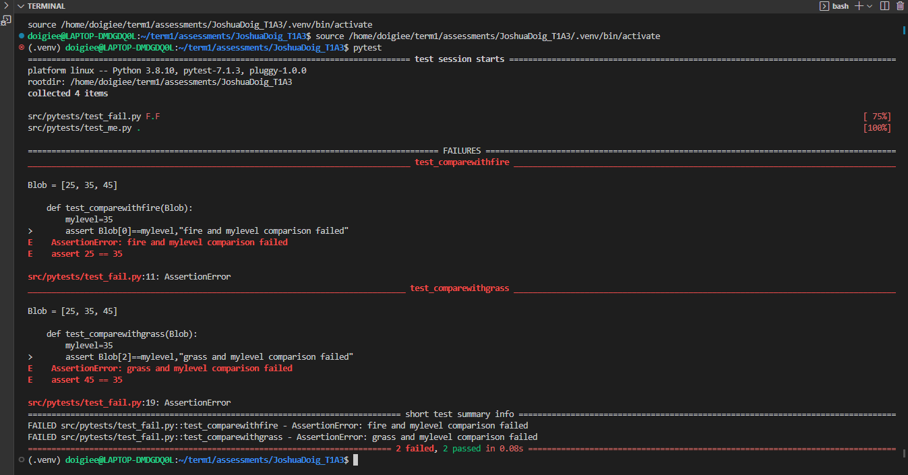
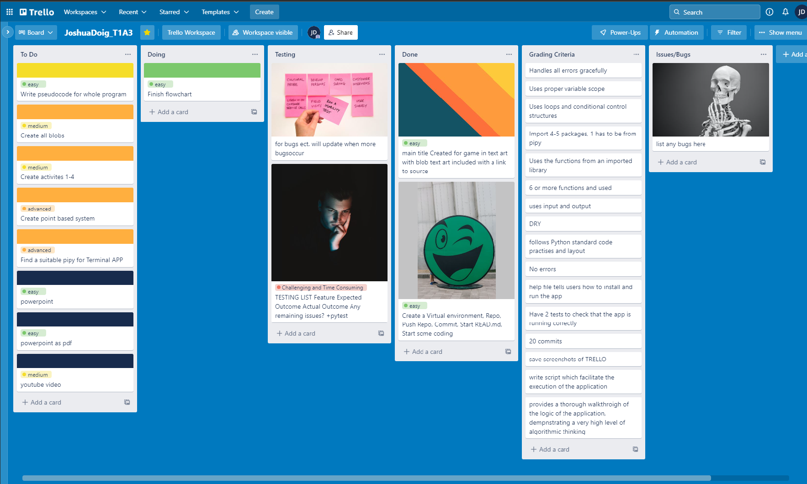
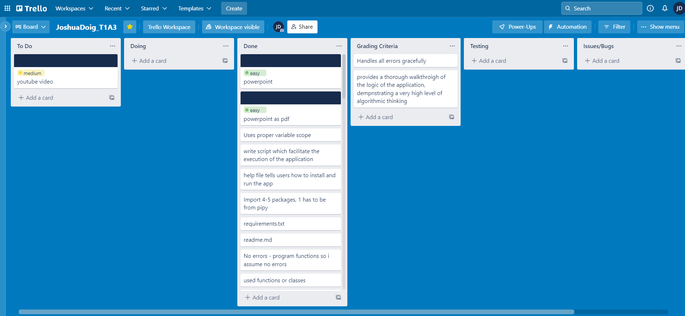

# Welcome to 'The Blob Game' README Markdown 
# JoshuaDoig_T1A3

#### Internet Sites Used:
#### Blob Title Image: https://textart.sh/topic/slime 
#### Blob Title Text: https://fsymbols.com 
#### Flowchart: https://app.diagrams.net/?libs=general;flowchart&src=about
#### Trello - Workspace Manager: https://trello.com/b/74KvlyR2/joshuadoigt1a3
#### Colorama 0.4.5: https://pypi.org/project/colorama/
#### Clearing 1.0.0: https://pypi.org/project/clearing/
#### simple-term-menu 1.5.1: https://pypi.org/project/simple-term-menu/
#### Grepper chrome extension: https://chrome.google.com/webstore/detail/grepper/amaaokahonnfjjemodnpmeenfpnnbkco?hl=en
#### W3Schools: https://www.w3schools.com/
#### Canva: https://www.canva.com/design/DAFNDKfOn1w/iOyEdffqzjnkzfl5uGaSFQ/edit


# Statement and Purpose
'The Blog Game' is a Terminal executable multichoice Storygame. It's a take on and combination of elements from games like 'Pokemon', 'Tamogachi' and multichoice-story games. In it users are introduced to the world of Tomogato and given the choice between 3 eggs to hatch. The user must then fulfill the town quest. raise a slime to level 100 before the town festival in 3 days.

The main Point of the game is for the player to enjoy choosing and raising their blob to level 100 through doing activited with thier blob.

Users should enjoy trying how to figure out how to get their blob to level 100 the fastest possible and maybe enjoy seeing the different text arts and stats for the blobs.

I made the game fairly presentable and colorful in sections to draw people in.

Feel free to look through docs to see print-outs from the game, flowcharts png, Implementation board etc.

# Features
My terminal app has the features of: having a main menu with instructions and quit option, pixel_art which is printed along with their chosen blob, level up/day countdown feature, colorful/highlighted text and a clearing of terminal for presentation/readablity. This game allows users to do activities with their virtual pet blob such as : fight together, eat together and play together in an attempt to gain levels before the due date of the town festival of light.

# Style Guide
PEP*- Style Guide of Python Code (to the best of my current ability).

# Installation Instructions
1. If you do not have Python installed on your computer, please install python [here](https://www.python.org/downloads/).

2. Now install pip onto your computer if you dont already have it installed also, [here](https://www.python.org/downloads/)

3. Clone my repository by inputting this comand when in the desired location of your terminal/Ubuntu

```
git clone https://github.com/Erkan-Kaban/TerminalApp.git
```

4. Now change into the file location of the cloned repository, looking for the src folder using,

```
cd src
```

5. Now you'll be able to run the blob game by executing the shell and entering the command

```
./The_Blob_Game.sh
```

You should be good to go. If the terminal prompts you to install any further dependancies, of course, press 'y' followed by 'enter key'.

Although If the game still doesn't run you can try running the following command in the terminal while in the cloned repository:

```
python3 main.py
```
OR Try the following if the previous command fails
```
python3 src/main.py
```


# Tests
had pytest installed and used it to test my code.
pytest was helpful when I had a menu import which wasn't working correctly (with infinite looping which I was unaware of). 
through this pytest I moved menu.py over to my main, and deleted menu.py. It would have been ideal to keep it seperate though It's all working now.

### manual testing
| Feture  |      Expected outcome     | Actual outcome |
|----------|:-------------:|------:|
| run through correctly |  to run through| as expected |
| test for blob 1 while loop |    print blob 1   |   as expected |
| test for blob 2 while loop |    print blob 2   |   as expected |
| test for blob 3 while loop |    print blob 3   |   as expected |
| repeat continue option |    repeats until y   |   as expected |
| menu display and options | displays can cycle through with printouts + quit|   as expected |
| return to main menu upon completion or loss | returns |   as expected |
| levels adding | adds depending on the activity |   as expected |
| wrong activity | stays in loops and allows another chance to type |   as expected |

### Pytest
pytest was also used throught development to test features


## Daily log
A basic outline of what was accomplished on a given day.

### Day 1 THURSDAY
Brainstormed ideas, submitted this one, got it appoved, created file on linux wsl linked to VScode, setup a virtual environment (venv.), git init,  git add . , git commit -m 'Inital Commit', and git push to my github repository as JoshuaDoig_T1A3. Then finished my flowchart and setup a Trello to track progress.


### Day 2 FRIDAY
Following my flowchart, began making pseudocode on main.py, functions and imports can be added and sorted out later. Basically creating bare bones and skeleton as '#' comments so that all will be left to do is figure out the code. (Had house inspection today so was busy for 2/3 of the day).

### Day 3 SATURDAY
Not a great deal of work was done today, mainly went over some of the ed content I missed.

### Day 4 SUNDAY
worked from 5 - 3pm  today though was able to import an external module colorama and apply it to my ASCII art. I decided to make the title screen red, blue and green to match the colors of the blobs i have.

### Day 5 MONDAY
added 1 more external imports from pypi. fixed a bit of code. 

### Day 6 TEUSDAY
Re evaluated code

### Day 7 WEDNESDAY
re evaluated code

### Day 8 THURSDAY
Basically finished a fleshed out working porgram still some debugging to do will be updating flowchart a little bit as im rethinking it and will add more classes imports to main if possible. youtube and powerpoint will need to be made in next couple of days as im working on sunday.



### Day 9 FRIDAY
Shuffling things around and trying to fix last bugs and get a 100% working simple program so that tommorow can be soley for recording youtube and powerpoint and submitting file as Sunday I have work.
Finally was able to fix the last 2 bugs that I had, stored all unused class and errorvalues messages in the unused.py file. now need to make a powerpoint and figure out the rest of it. Game is very simple in design, though I accomplished basically everything i set out to do.

countless manual tests and runthroughs to fix bugs, display, and pretty up code.

Starting making powerpoint with 


### Day 10 SATURDAY
Presentation and tidying, learning more about final features how to do a couple of things.


### Day 11 SUNDAY
Submittion day

# Author
Joshua Doig

